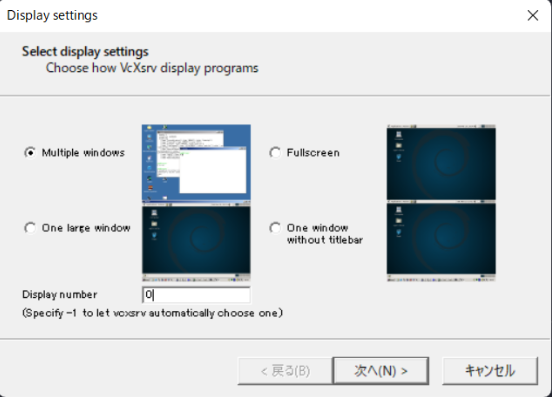
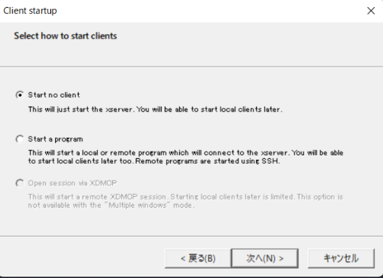
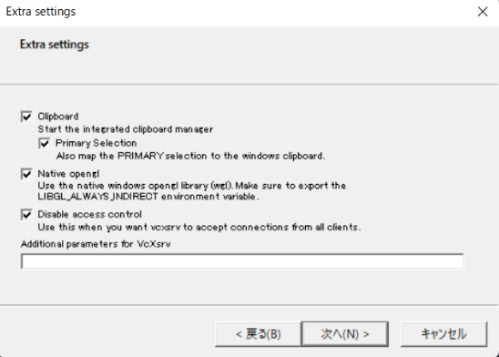
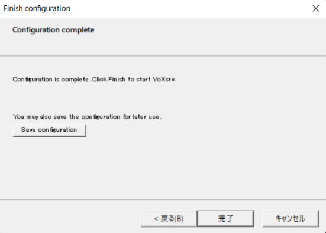

# PythonMachineLearning
Machine learning Python sample program collection.   

## Environment
Windows  
[Docker Desktop for Windows](https://docs.docker.com/desktop/windows/install/)  
[Visual Stdio Code](https://azure.microsoft.com/ja-jp/products/visual-studio-code/)  
[Remote-Containers](https://marketplace.visualstudio.com/items?itemName=ms-vscode-remote.remote-containers)  
[VcXsrv](https://sourceforge.net/projects/vcxsrv/)  

## Python version
3.10.4

## Python libraries
pandas  
numpy  
matplotlib  
seaborn  
flake8  
autopep8  
pytest  
scikit-learn  
opencv-python  
opencv-contrib-python  
tensorflow-gpu  
keras  
janome  
networkx  
wordcloud  

## How to use
### 1. Launch VcXsrv
execute xlaunch.exe  
  
  
  
  

### 2. Open root directory with VSCode
Open root directory of this repository with VSCode  
  

### 3. Open folder in container  
Click the following icon  
  

When you open for the first time, select "Open Folder in Container"  
  

Select this repository's folder  
  

### 4. Build container
Building container will start  
  

After buidling, installing python libraries will start  
  

Installation will finish as follow  
  

### 5. Confirmation
Open terminal and confirm Python's version  
  

Execute sample code  
The following graph window will be shown  
  

## Reference
* [VcXsrvの自動起動](https://qiita.com/nab/items/d4e6eb54815a993382af) 
* [Docker Desktop for Windows で X Window を使ってGUI表示](https://wisteriahill.sakura.ne.jp/CMS/WordPress/2020/09/02/docker-desktop-for-windows-x-window-gui/)  
* [Docker x 可視化がうまくいかずハマったのでまとめてみた！](https://qiita.com/oreyutarover/items/cca3511012b6ad97a1ce)  
* [WSL2＋Ubuntu 20.04でGUIアプリを動かす](https://astherier.com/blog/2020/08/run-gui-apps-on-wsl2/)  
* [vscodeのdevcontainer内でelectronのGUIアプリを作りたかった](https://blog.ikappio.com/try-creating-electron-gui-app-in-devcontainer-of-vscode/)  
* [【venv不要】Remote Containersで作る最強のPython開発環境【VSCode/Docker】](https://qiita.com/0MeO/items/1fc3995e568d2c95569e)  